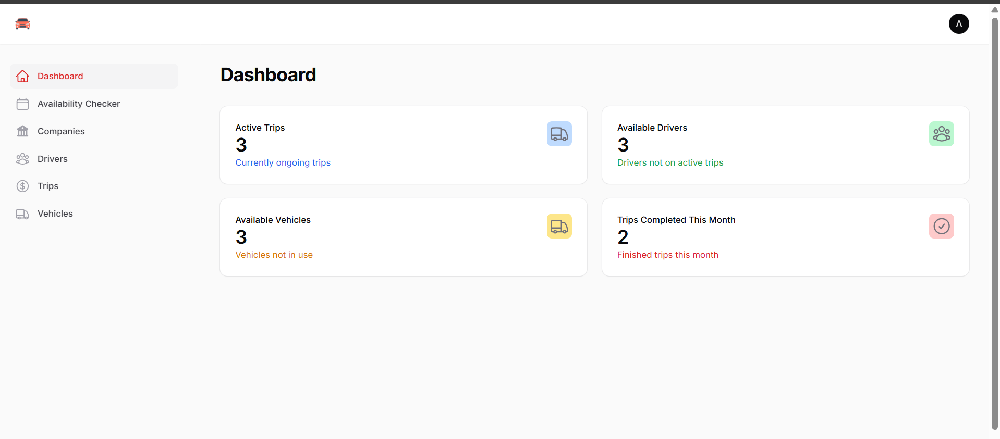
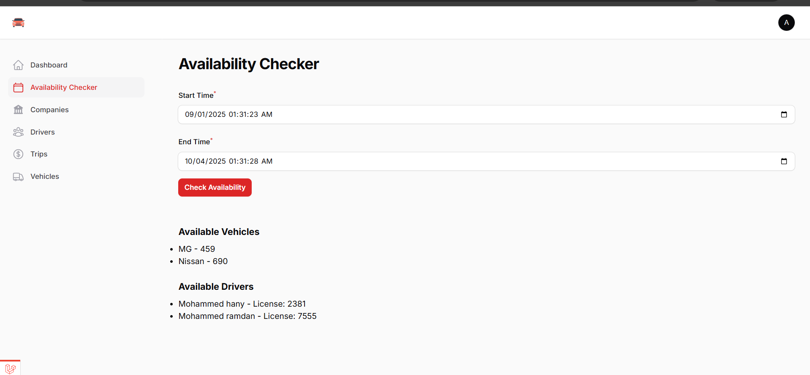
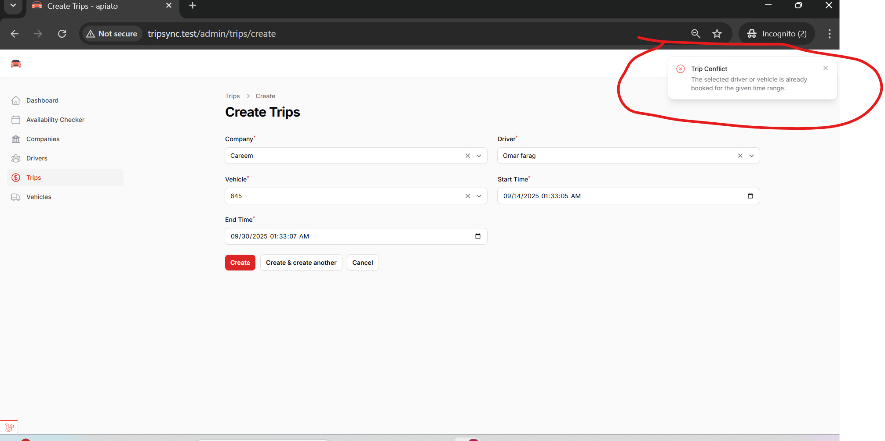
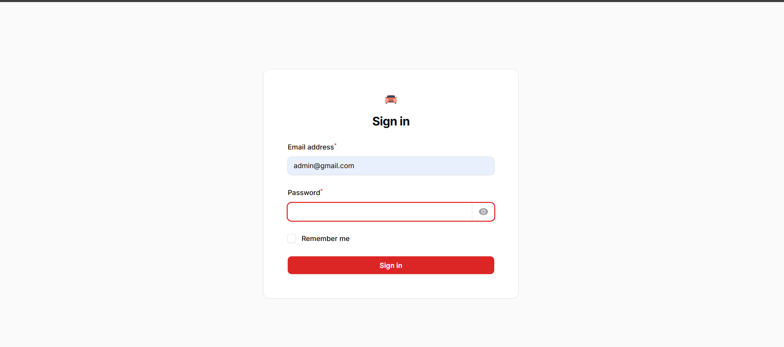
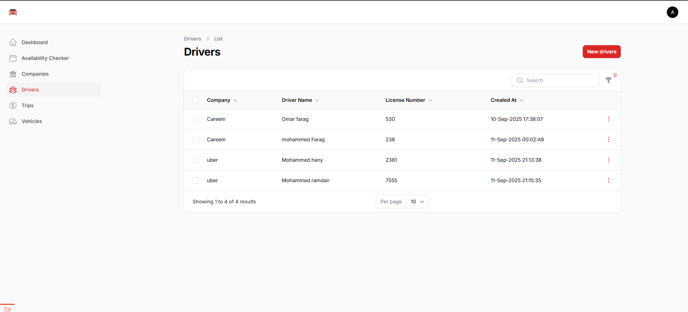

# TripSync
> A comprehensive travel synchronization and management platform built with Laravel

[](https://laravel.com)
[](https://php.net)
[](https://mysql.com)

## 🚀 About

TripSync is a powerful travel management platform that helps users synchronize their travel plans, collaborate with fellow travelers, and organize their trips efficiently. Built with Laravel's robust framework, it provides a seamless experience for managing all aspects of your travel adventures.

## 📸 Screenshots

### Dashboard Overview

*Main dashboard showing trip overview and quick actions*

### Availability Checker


### Stop overlapping trips


### sign in


### driver


## ⚡ Prerequisites

Before you begin, ensure you have the following installed:

- **PHP** >= 8.3
- **Composer** >= 2.0
- **MySQL** >= 8.0
- **Node.js** >= 16.0 (for frontend assets)

## 🛠️ Installation

### 1. Clone the Repository

```bash
git clone https://github.com/Ehab298/TripSync.git
cd TripSync
```

### 2. Install Dependencies

```bash
composer install
npm install && npm run build
```

### 3. Generate Application Key

```bash
php artisan key:generate
```

## ⚙️ Configuration

### Environment Setup

1. Copy the example environment file:

```bash
cp .env.example .env
```

2. Edit the `.env` file with your configuration:

```env
# Application Settings
APP_NAME="TripSync"
APP_ENV=local
APP_KEY=base64:PTOt4b2rRYG1D/jw9Cf+ZvoNBZrvTfcTL12zcFiPYEo=
APP_URL=http://tripsync.test
API_URL=http://tripsync.test
API_PREFIX=/
APP_DEBUG=true
API_DEBUG=true

LOG_CHANNEL=stack
LOG_LEVEL=debug

# Database Configuration
DB_CONNECTION=mysql
DB_HOST=127.0.0.1
DB_PORT=3306
DB_DATABASE=tripsync
DB_USERNAME=root
DB_PASSWORD=your_password_here

# Cache & Session
CACHE_DRIVER=file
SESSION_DRIVER=file
SESSION_LIFETIME=120
QUEUE_CONNECTION=database

# Email Configuration (Optional)
MAIL_MAILER=smtp
MAIL_HOST=mailhog
MAIL_PORT=1025
MAIL_USERNAME=null
MAIL_PASSWORD=null
MAIL_ENCRYPTION=null
MAIL_FROM_ADDRESS="hello@tripsync.com"
MAIL_FROM_NAME="${APP_NAME}"

# OAuth Keys (Laravel Passport)
PASSPORT_PRIVATE_KEY="file://storage/oauth-private.key"
PASSPORT_PUBLIC_KEY="file://storage/oauth-public.key"

# API Configuration
API_TOKEN_EXPIRES=1440
API_REFRESH_TOKEN_EXPIRES=43200
REQUIRE_EMAIL_VERIFICATION=true
EMAIL_VERIFICATION_LINK_EXPIRATION_TIME_IN_MINUTE=30
```

> ⚠️ **Important**: Replace `your_password_here` with your actual MySQL password and update paths as needed for your environment.

## 🗄️ Database Setup

### 1. Create Database

Create a new MySQL database named `tripsync`:

```sql
CREATE DATABASE tripsync;
```

### 2. Run Migrations

Execute the database migrations to create all necessary tables:

```bash
php artisan migrate
```

### 3. Seed Database (Optional)

Populate the database with sample data:

```bash
php artisan db:seed
```

### 4. Generate OAuth Keys

Generate Laravel Passport keys for API authentication:

```bash
php artisan passport:keys
```

## 🔧 Additional Setup

### 1. Create Admin User

Create an admin user for the Filament admin panel:

```bash
php artisan make:filament-user
```

### 2. Start the Development Server

```bash
php artisan serve
```

<div align="center">
  
**Made with ❤️ by the TripSync Team**

[](https://github.com/Ehab298/TripSync)
[](https://laravel.com)

</div>
